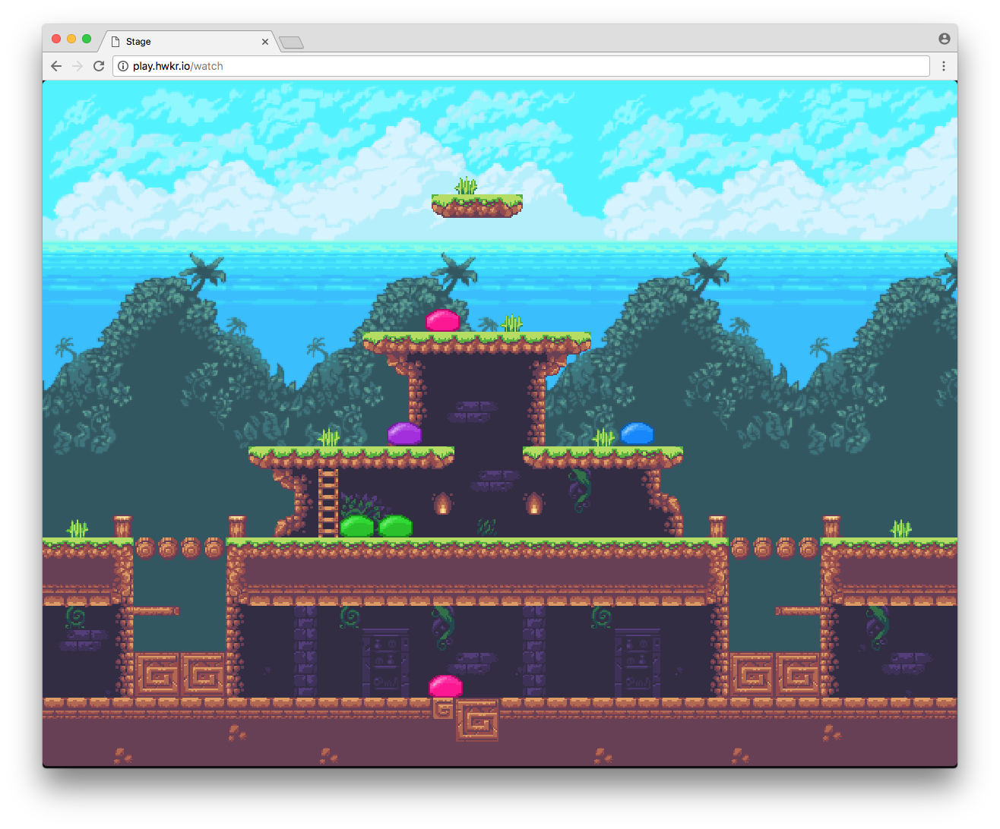
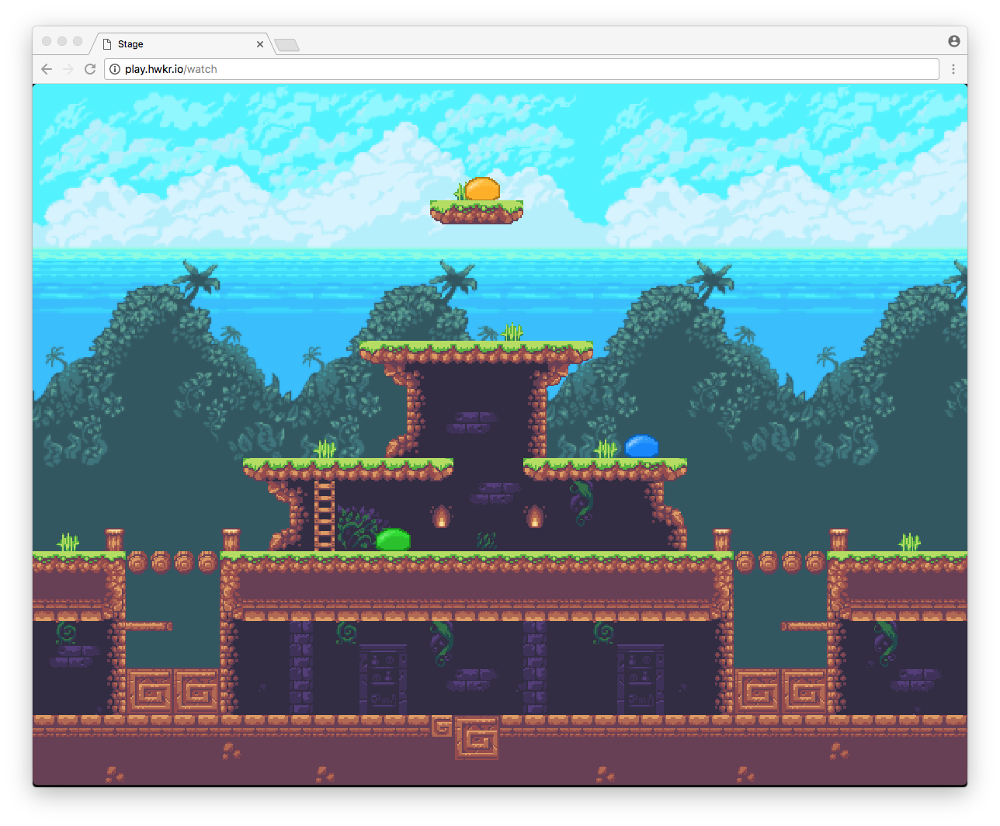
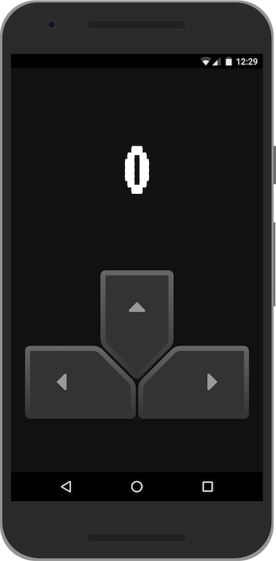

# Ping

This game was created for UVic ART 261 Fall 2017. It explores privilege through the context of a video game.

## Screenshots

### Stage view

### Player Controls on Phone

## Getting Started

### Up and Running
* `npm install`
* `npm start`
* visit `http://localhost:8080/`

### Deploying to Heroku

* `git push heroku master`

# Attributions

* Built with [Phaser](https://phaser.io/)
* Background tileset by [Ansimuz](https://opengameart.org/users/ansimuz)
